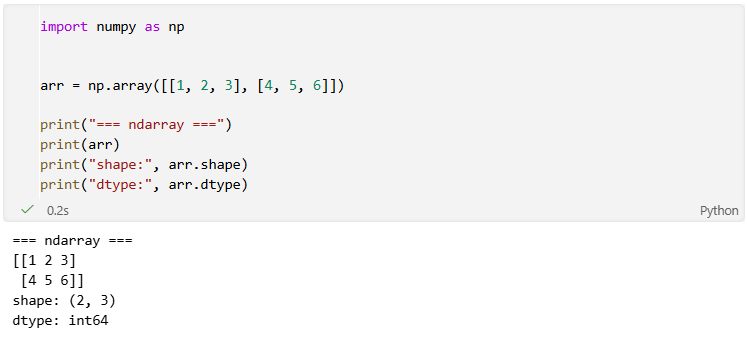
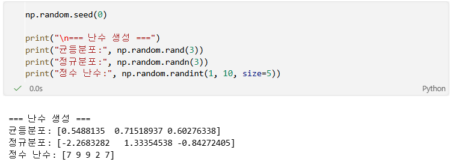
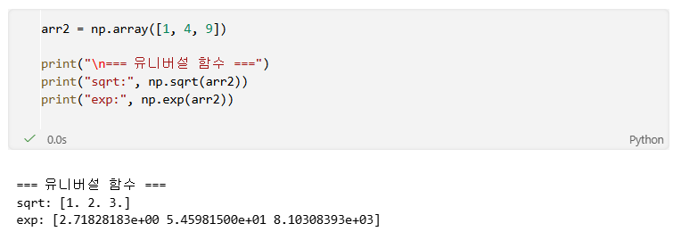
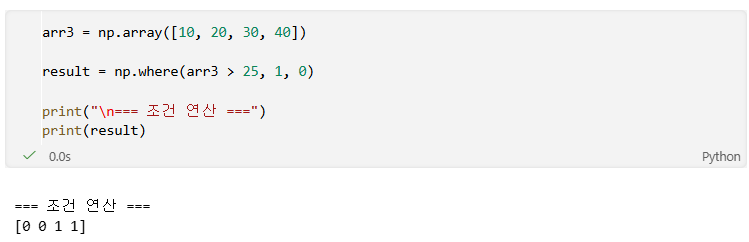
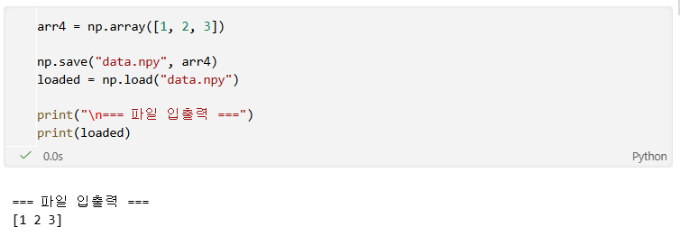
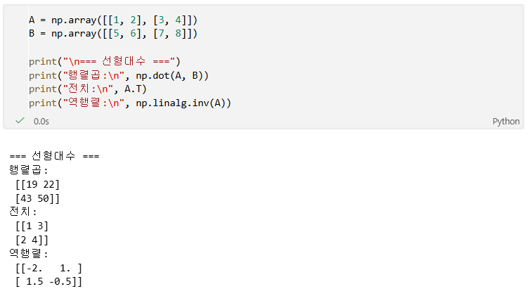
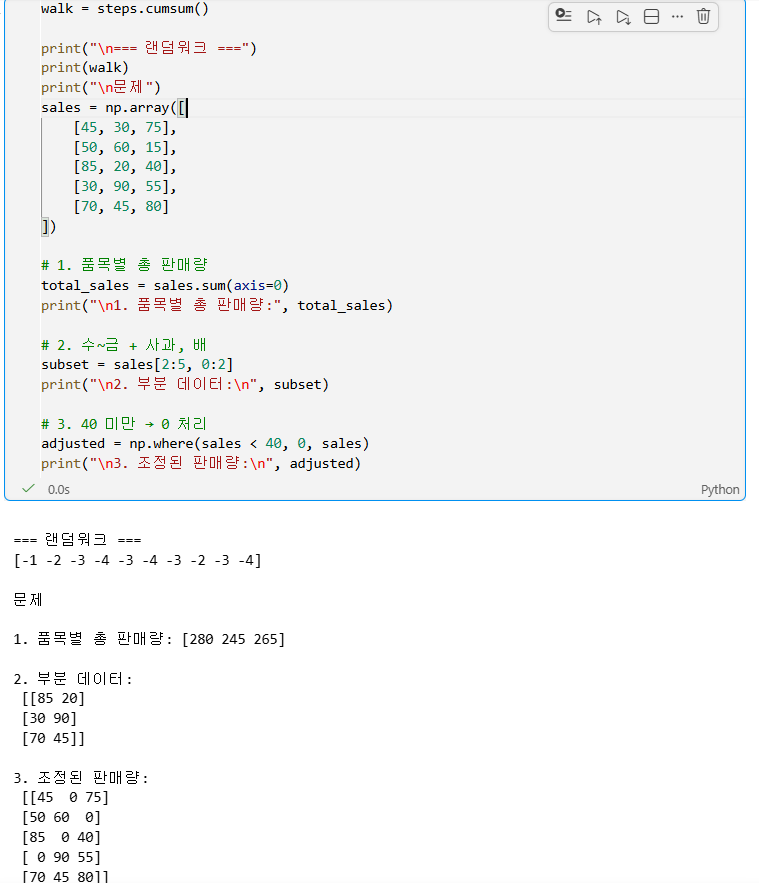

# Python 3주차 정규 과제 

📌Python 정규과제는 매주 정해진 분량의 『*파이썬 라이브러리를 활용한 데이터 분석*』 을 읽고 학습하는 것입니다. 이번주는 아래의 **Python_3rd_TIL**에 나열된 분량을 읽고 공부하시면 됩니다.

아래의 문제를 풀어보며 학습 내용을 점검하세요. 문제를 해결하는 과정에서 개념을 스스로 정리하고, 필요한 경우 참고 자료를 통해 보완하는 것이 좋습니다.

**교재 실습 예제 파일은 07_Python_Template 레포지토리의 notebooks 폴더에 업로드되어 있습니다.**

**👀(수행 인증샷은 필수입니다.)** 

## Python_3rd_TIL

### 4장 넘파이 기본: 배열과 벡터 연산
#### 1. 다차원 배열 객체 ndarray
#### 2. 난수 생성
#### 3. 유니버설 함수: 배열의 각 원소를 빠르게 처리하는 함수
#### 4. 배열을 이용한 배열 기반 프로그래밍
#### 5. 배열 데이터의 파일 입출력
#### 6. 선형대수
#### 7. 계단 오르내리기 예제
#### 8. 마치며 


## Study Schedule

| 주차  | 공부 범위     | 완료 여부 |
| ----- | ------------- | --------- |
| 1주차 | p.25~82    | ✅         |
| 2주차 | p.83~129   | ✅         |
| 3주차 | p.131~179  | ✅         |
| 4주차 | p.181~246 | 🍽️         |
| 5주차 | p.247~309 | 🍽️         |
| 6주차 | p.310~379 | 🍽️         |
| 7주차 | p.381~465 | 🍽️         |


<br>

<!-- 여기까진 그대로 둬 주세요-->

---

# 1️⃣ 학습 내용 정리

## 1. 다차원 배열 객체 ndarray

### 개념정리
- 넘파이의 핵심 자료구조는 ndarray (N-dimensional array)
- 동일한 데이터 타입을 가지는 다차원 배열
- Python 리스트보다 메모리 효율성과 연산 속도가 뛰어남

**핵심 속성**
- shape : 배열 구조
- dtype : 데이터 타입<br>
벡터화 연산 가능 → **반복문 없이 계산 가능**
### 실습 인증

<!-- 예제 실습을 진행한 후, 실행 화면을 2-3장 캡쳐하여 제출해주세요. -->




## 2. 난수 생성

### 개념정리

### 개념정리
- numpy.random을 사용하여 난수 생성
- 데이터 시뮬레이션 및 모델링에 활용

**주요 함수**
- rand : 균등분포
- randn : 정규분포
- randint : 정수 난수

### 실습 인증

<!-- 예제 실습을 진행한 후, 실행 화면을 2-3장 캡쳐하여 제출해주세요. -->




## 3. 유니버설 함수: 배열의 각 원소를 빠르게 처리하는 함수

### 개념정리

### 개념정리
- 배열의 각 원소에 대해 연산을 수행하는 함수
- 반복문 없이 빠르게 계산 가능 (벡터화)

**특징**
- element-wise 연산 수행
- 고속 연산 가능

### 실습 인증

<!-- 예제 실습을 진행한 후, 실행 화면을 2-3장 캡쳐하여 제출해주세요. -->




## 4. 배열을 이용한 배열 기반 프로그래밍

### 개념정리

### 개념정리
- 배열 연산을 이용하여 반복문 없이 계산 수행
- 벡터화(vectorization) 개념

**장점**
- 코드 간결성 증가
- 연산 속도 향상

### 실습 인증




<!-- 이 부분을 지우고 실행 화면을 제출해주세요. -->


## 5. 배열 데이터의 파일 입출력

### 개념정리

### 개념정리
- numpy 배열을 파일로 저장 및 불러오기 가능

**주요 함수**
- save / load : 바이너리 파일
- savetxt / loadtxt : 텍스트 파일


### 실습 인증

<!-- 예제 실습을 진행한 후, 실행 화면을 2-3장 캡쳐하여 제출해주세요. -->




## 6. 선형대수

### 개념정리

### 개념정리
- numpy는 기본적인 행렬 연산을 지원

**주요 연산**
- 행렬 곱
- 전치
- 역행렬

### 실습 인증

<!-- 예제 실습을 진행한 후, 실행 화면을 2-3장 캡쳐하여 제출해주세요. -->




## 7. 계단 오르내리기 예제

### 개념정리

### 개념정리
- 난수를 이용한 랜덤워크(Random Walk) 시뮬레이션
- 확률 과정 기반 모델링 예제

### 실습 인증

<!-- 예제 실습을 진행한 후, 실행 화면을 2-3장 캡쳐하여 제출해주세요. -->




# 2️⃣ 실습 과제

각 문제에 대한 실행 결과가 확인되도록 코드를 작성하고 실행한 뒤, **모든 문제의 실행 화면을 캡처하여 제출하시기 바랍니다.**

**1. 아래 코드를 실행하여 5일간 3개 품목의 판매량 데이터를 생성합니다.**
```python
import numpy as np

# 5일간 3개 품목의 판매량
# 행: 월, 화, 수, 목, 금 / 열: 사과, 배, 포도
sales = np.array([
    [45, 30, 75],  # 월요일
    [50, 60, 15],  # 화요일
    [85, 20, 40],  # 수요일
    [30, 90, 55],  # 목요일
    [70, 45, 80]   # 금요일
])
```

**2. 문제**
```
1. 품목별 총 판매량 계산 및 출력
  - 문제 설명: 각 품목이 5일 동안 총 몇 개 팔렸는지 계산
  - sum() 메서드의 axis 옵션을 활용하여 품목별 합계를 구하세요.
  - print()를 이용해 품목별 총 판매량 리스트를 출력하세요.

2. 특정 기간 및 품목 추출
  - 문제 설명: 수요일부터 금요일까지(3~5행), 첫 번째와 두 번째 품목(사과, 배)의 판매량만 따로 보기 
  - 배열 슬라이싱을 사용하여 해당 데이터를 추출하세요.
  - print()를 이용해 추출된 3x2 배열을 출력하세요.

3. 목표 미달 판매량 조정
  - 문제 설명: 하루 판매량이 40개 미만인 경우, 값을 0으로 표시하고, 40개 이상인 경우는 기존 값을 유지
  - np.where() 함수를 사용하여 40 미만은 0, 40 이상은 원래 값을 가지는 새로운 배열을 만드세요.
  - print()를 이용해 수정된 배열을 출력하세요.
```


### 🎉 수고하셨습니다.
