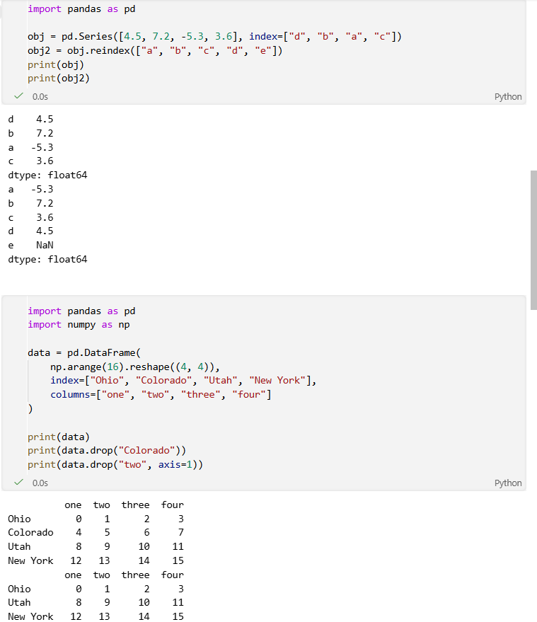
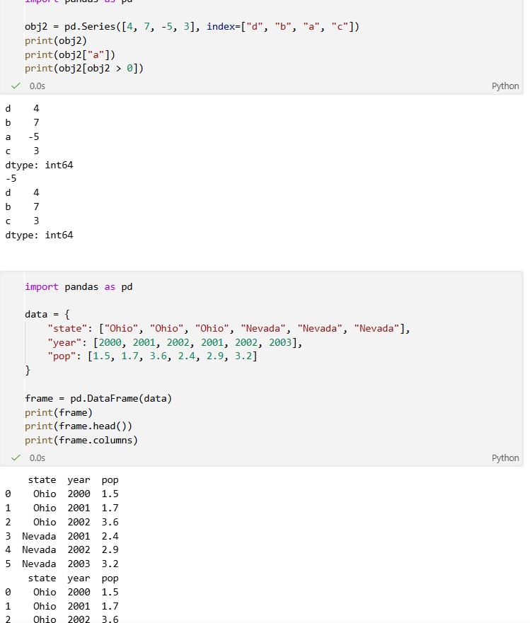
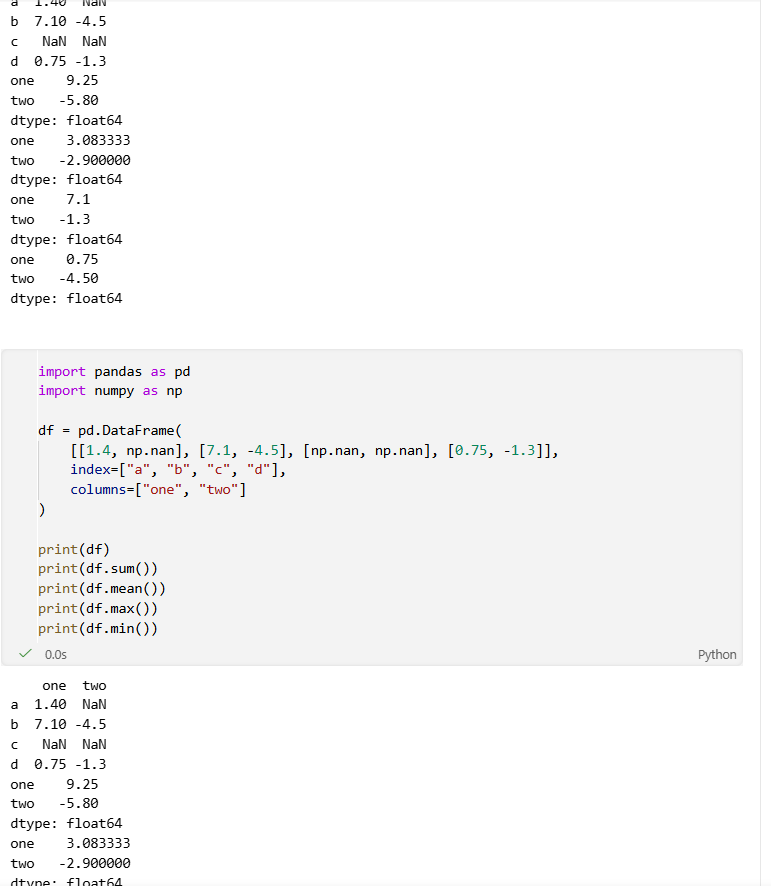
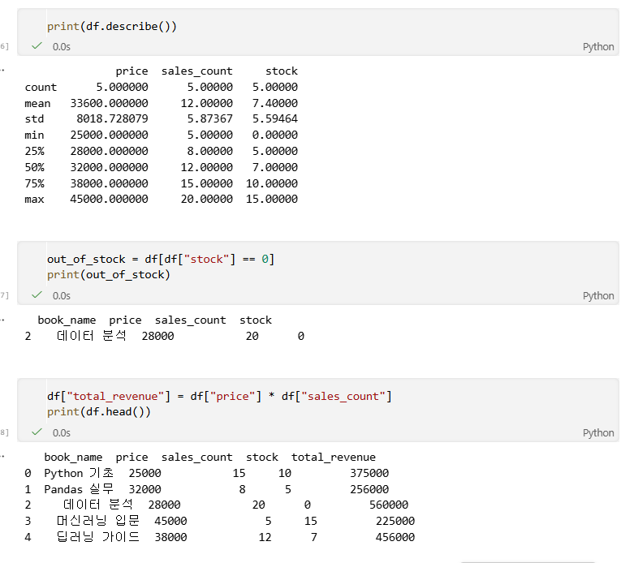

# Python 4주차 정규 과제 

📌Python 정규과제는 매주 정해진 분량의 『*파이썬 라이브러리를 활용한 데이터 분석*』 을 읽고 학습하는 것입니다. 이번주는 아래의 **Python_4th_TIL**에 나열된 분량을 읽고 공부하시면 됩니다.

아래의 문제를 풀어보며 학습 내용을 점검하세요. 문제를 해결하는 과정에서 개념을 스스로 정리하고, 필요한 경우 참고 자료를 통해 보완하는 것이 좋습니다.

**교재 실습 예제 파일은 07_Python_Template 레포지토리의 notebooks 폴더에 업로드되어 있습니다.**

**👀(수행 인증샷은 필수입니다.)** 

## Python_4th_TIL

### 5장 판다스 시작하기 
#### 1. 판다스 자료구조 소개
#### 2. 핵심 기능
#### 3. 기술 통계 계산과 요약
#### 4. 마치며 


## Study Schedule

| 주차  | 공부 범위     | 완료 여부 |
| ----- | ------------- | --------- |
| 1주차 | p.25~82    | ✅         |
| 2주차 | p.83~129   | ✅         |
| 3주차 | p.131~179  | ✅         |
| 4주차 | p.181~246 | ✅         |
| 5주차 | p.247~309 | 🍽️         |
| 6주차 | p.310~379 | 🍽️         |
| 7주차 | p.381~465 | 🍽️         |


<br>

<!-- 여기까진 그대로 둬 주세요-->

---

# 1️⃣ 학습 내용 정리

## 1. 판다스 자료구조 소개

### 개념정리


#### 1. Series
 - 1차원 배열 형태
 - index + 값(value) 구조
 - numpy 배열 기반
#### 2. DataFrame
 - 2차원 테이블 구조 (엑셀 느낌)
 - 행(row)과 열(column)로 구성
 - 서로 다른 자료형을 하나의 객체에 저장 가능
#### 3. Index
 - 데이터의 축(axis)을 나타내는 객체
 - 변경 불가능(immutable)

핵심:판다스는 numpy의 성능 + SQL/엑셀의 직관성을 결합한 구조

### 실습 인증

<!-- 예제 실습을 진행한 후, 실행 화면을 2-3장 캡쳐하여 제출해주세요. -->




## 2. 핵심 기능

### 개념정리

#### 1. 재색인 (reindex)
 - 새로운 index 기준으로 데이터 재정렬
#### 2. 데이터 선택 / 필터링
 - loc, iloc, 조건문(Boolean indexing)
#### 3. 삭제
 - drop() 함수 사용
#### 4. 연산
 - 자동 정렬 기반 연산 수행
 - 결측치는 NaN 처리
#### 5. 함수 적용
 - apply() → 행/열 단위 함수 적용
 - map() → Series에 적용
#### 6. 정렬
 - sort_values(), sort_index()
### 실습 인증

<!-- 예제 실습을 진행한 후, 실행 화면을 2-3장 캡쳐하여 제출해주세요. -->




## 3. 기술 통계 계산과 요약

### 개념정리

#### 주요 함수
 - describe() → 기술통계 요약
 - mean() → 평균
 - std() → 표준편차
 - min(), max() → 최소/최대
 - sum() → 합계
#### 추가 기능
 - 상관계수: corr()
 - 공분산: cov()
 - 값 개수: value_counts()
### 실습 인증

<!-- 예제 실습을 진행한 후, 실행 화면을 2-3장 캡쳐하여 제출해주세요. -->




# 2️⃣ 실습 과제

각 문제에 대한 실행 결과가 확인되도록 코드를 작성하고 실행한 뒤, **모든 문제의 실행 화면을 캡처하여 제출하시기 바랍니다.**

**1. 아래 코드를 실행하여 도서 매출 데이터를 생성합니다.**
```python
import pandas as pd
import numpy as np

# 도서 데이터 생성
data = {
    "book_name": ["Python 기초", "Pandas 실무", "데이터 분석", "머신러닝 입문", "딥러닝 가이드"],
    "price": [25000, 32000, 28000, 45000, 38000],
    "sales_count": [15, 8, 20, 5, 12],
    "stock": [10, 5, 0, 15, 7]
}
df = pd.DataFrame(data)
```

**2. 문제**
```
1. 데이터 확인 및 기초 통계 출력
  - 문제 설명: 요약 정보 확인 
  - describe() 메서드를 사용하여 수치형 데이터(가격, 판매량 등)의 기술 통계 정보를 출력하세요.
  - print()를 이용해 기술 통계 결과를 화면에 출력하세요.

2. 특정 조건의 데이터 필터링 (불리언 색인)
  - 문제 설명: 현재 재고가 하나도 없는(0인) 도서 찾기 
  - stock 열의 값이 0인 행만 추출하여 새로운 변수에 저장하세요.
  - print()를 이용해 재고가 0인 도서의 정보를 출력하세요.

3. 새로운 열 추가 (파생 변수 생성)
  - 문제 설명: 각 도서별 총 매출액(total_revenue) 계산
  - price와 sales_count를 곱하여 total_revenue라는 새로운 열을 추가하세요.
  - print()를 이용해 새로운 열이 추가된 DataFrame의 상단 5행(head)을 출력하세요.
```




### 🎉 수고하셨습니다.
