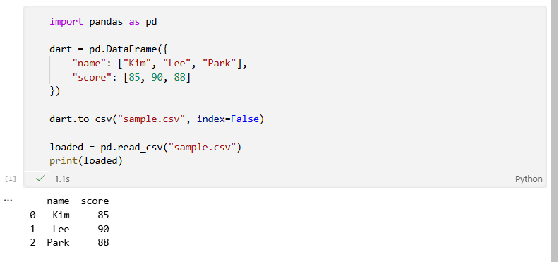
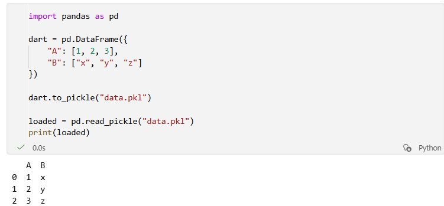
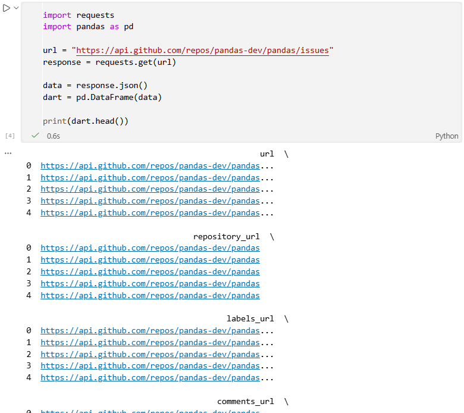
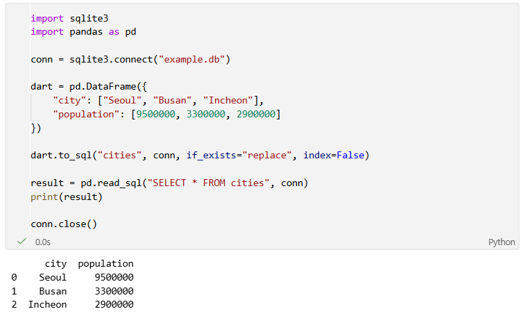
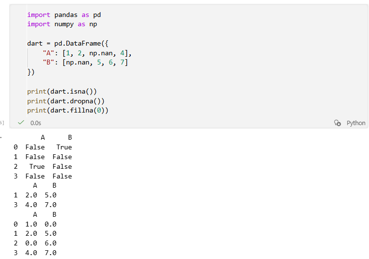
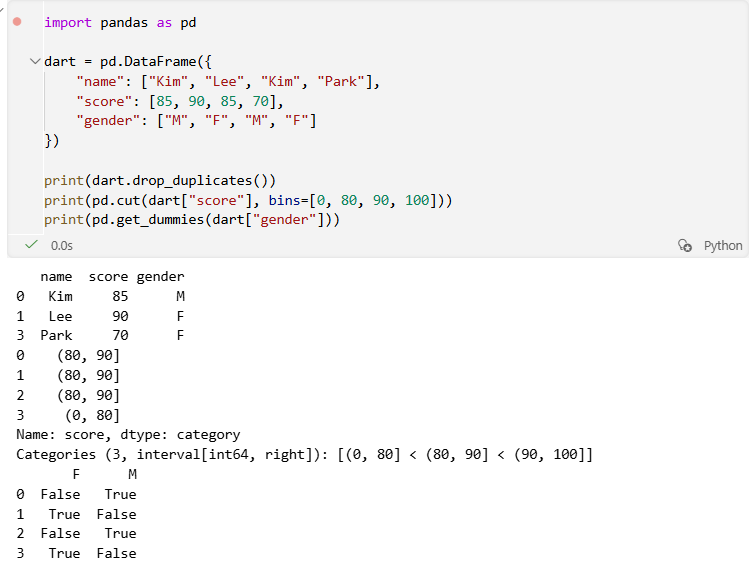
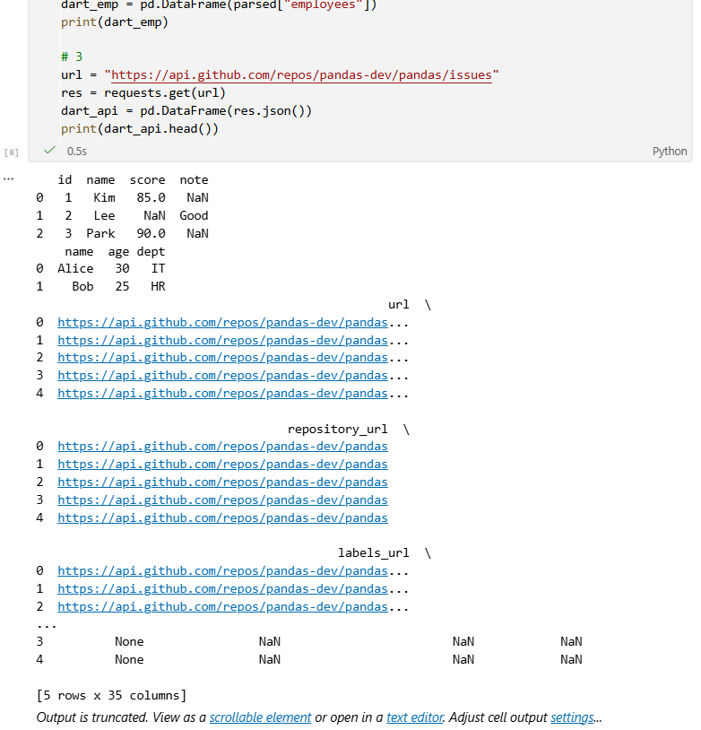

# Python 5주차 정규 과제 

📌Python 정규과제는 매주 정해진 분량의 『*파이썬 라이브러리를 활용한 데이터 분석*』 을 읽고 학습하는 것입니다. 이번주는 아래의 **Python_5th_TIL**에 나열된 분량을 읽고 공부하시면 됩니다.

아래의 문제를 풀어보며 학습 내용을 점검하세요. 문제를 해결하는 과정에서 개념을 스스로 정리하고, 필요한 경우 참고 자료를 통해 보완하는 것이 좋습니다.

**교재 실습 예제 파일은 07_Python_Template 레포지토리의 notebooks 폴더에 업로드되어 있습니다.**

**아나콘다 환경에서는 많은 패키지가 기본적으로 포함되어 있어 별도의 설치 없이 사용할 수 있지만, 환경에 따라 conda install이나 pip install이 필요할 수 있습니다.**

**👀(수행 인증샷은 필수입니다.)** 

## Python_5th_TIL

### 6장 데이터 로딩과 저장, 파일 형식
#### 1. 텍스트 파일에서 데이터를 읽고 쓰는 법
#### 2. 이진 데이터 형식
#### 3. 웹 API와 함께 사용하기
#### 4. 데이터베이스와 함께 사용하기
#### 5. 마치며
### 7장 데이터 정제 및 준비
#### 1. 누락된 데이터 처리하기
#### 2. 데이터 변형 


## Study Schedule

| 주차  | 공부 범위     | 완료 여부 |
| ----- | ------------- | --------- |
| 1주차 | p.25~82    | ✅         |
| 2주차 | p.83~129   | ✅         |
| 3주차 | p.131~179  | ✅         |
| 4주차 | p.181~246 | ✅         |
| 5주차 | p.247~309 | ✅         |
| 6주차 | p.310~379 | 🍽️         |
| 7주차 | p.381~465 | 🍽️         |


<br>

<!-- 여기까진 그대로 둬 주세요-->

---

# 1️⃣ 학습 내용 정리

## 1. 텍스트 파일에서 데이터를 읽고 쓰는 법

### 개념정리

- 텍스트 파일(CSV, TSV 등)은 가장 기본적인 데이터 저장 형식
- pd.read_csv() 로 파일 로드
- 주요 옵션
- sep : 구분자 지정
- encoding : 인코딩 설정
- na_values : 특정 문자열을 결측치로 처리
- nrows : 일부 데이터만 로드
- 저장은 to_csv() 사용
- index = False : 인덱스 제외
### 실습 인증

<!-- 예제 실습을 진행한 후, 실행 화면을 2-3장 캡쳐하여 제출해주세요. -->




## 2. 이진 데이터 형식

### 개념정리

- 텍스트보다 빠르고 효율적인 저장 방식
- 데이터 타입 유지 가능
- 대표 형식: pickle

#### 주요 함수:
- to_pickle() : 저장
- read_pickle() : 불러오기
### 실습 인증

<!-- 예제 실습을 진행한 후, 실행 화면을 2-3장 캡쳐하여 제출해주세요. -->




## 3. 웹 API와 함께 사용하기

### 개념정리

- 웹 API: 외부 서버에서 데이터를 JSON 형태로 제공
- requests 로 데이터 요청

#### 흐름:
- requests.get() → API 호출
- .json() → JSON 변환
- DataFrame 생성
### 실습 인증

<!-- 예제 실습을 진행한 후, 실행 화면을 2-3장 캡쳐하여 제출해주세요. -->




## 4. 데이터베이스와 함께 사용하기

### 개념정리

- 데이터베이스 → SQL로 데이터 관리
- read_sql() 로 DataFrame 변환 가능
- to_sql() 로 DB 저장 가능
### 실습 인증

<!-- 예제 실습을 진행한 후, 실행 화면을 2-3장 캡쳐하여 제출해주세요. -->




## 5. 누락된 데이터 처리하기

### 개념정리

- 결측치: NaN, None
- 확인 : isna(), isnull()
#### 처리
- 제거: dropna()
- 대체: fillna()
### 실습 인증

<!-- 예제 실습을 진행한 후, 실행 화면을 2-3장 캡쳐하여 제출해주세요. -->




## 6. 데이터 변형 

### 개념정리

- 중복 제거: drop_duplicates()
- 값 변환: map(), replace()
- 구간화: cut()
- 더미 변수: get_dummies()
### 실습 인증

<!-- 예제 실습을 진행한 후, 실행 화면을 2-3장 캡쳐하여 제출해주세요. -->




# 2️⃣ 실습 과제

각 문제에 대한 실행 결과가 확인되도록 코드를 작성하고 실행한 뒤, **모든 문제의 실행 화면을 캡처하여 제출하시기 바랍니다.**

**1. 아래 코드를 실행하여 텍스트와 데이터를 선언합니다.**
```python
import pandas as pd
import json
import requests

# 1. 테스트용 CSV 내용 (메모리 내 시뮬레이션용)
csv_data = "id,name,score,note\n1,Kim,85,NA\n2,Lee,NULL,Good\n3,Park,90,None"
with open("test_data.csv", "w") as f:
    f.write(csv_data)

# 2. 테스트용 JSON 문자열
json_obj = """
{
    "company": "DataService",
    "employees": [
        {"name": "Alice", "age": 30, "dept": "IT"},
        {"name": "Bob", "age": 25, "dept": "HR"}
    ]
}
"""
```

**2. 문제**
```
1. CSV 파일 읽기 및 결측치 지정
  - 문제 설명: 제공받은 test_data.csv 파일을 읽어오기(단, 데이터의 특성에 맞게 옵션 설정)
  - read_csv()를 사용하여 파일을 읽으세요.
  - 이때 NA, NULL, None이라는 문자열을 모두 **결측치(NaN)**로 인식하도록 na_values 옵션을 설정하세요.
  - print()를 이용해 읽어온 DataFrame을 출력하세요.

2. JSON 데이터 변환 및 특정 데이터 추출
  - 문제 설명: 문자열 형태의 JSON 데이터를 파싱하여 직원 명단만 추출
  - json.loads()를 사용하여 json_obj 문자열을 파이썬 객체로 변환하세요.
  - 변환된 객체에서 employees 리스트만 추출하여 DataFrame으로 만드세요.
  - print()를 이용해 생성된 직원 명단 DataFrame을 출력하세요.

3. 웹 API 데이터 가져오기
  - 문제 설명: 판다스 깃허브 저장소의 이슈(Issues) 데이터를 가져와 상위 항목 확인
  - requests.get()을 사용하여 https://api.github.com/repos/pandas-dev/pandas/issues URL의 데이터를 가져오세요.
  - 응답받은 JSON 데이터를 DataFrame으로 변환하세요.
  - print()를 이용해 데이터의 상단 5행(head)을 출력하세요.
```




### 🎉 수고하셨습니다.
