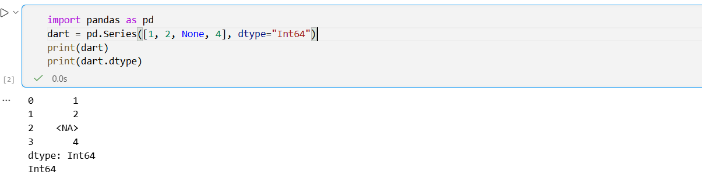
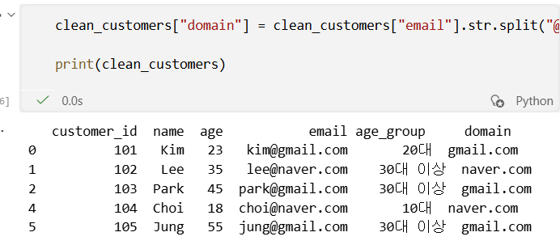
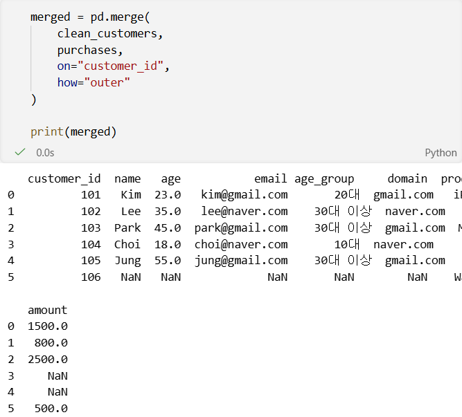
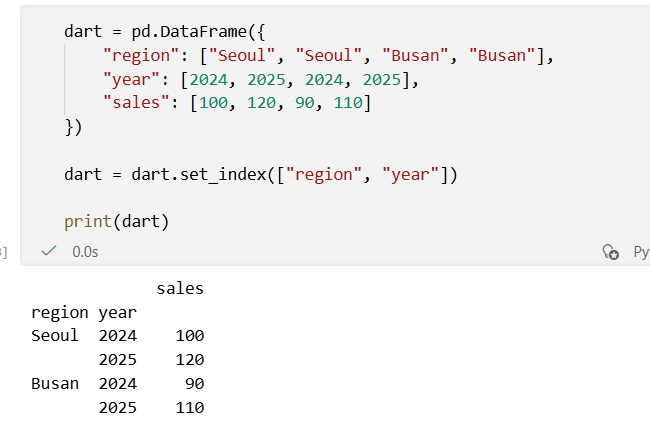
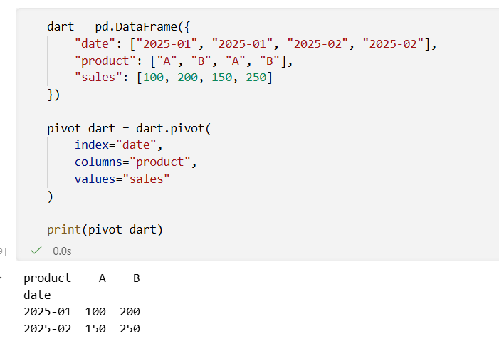
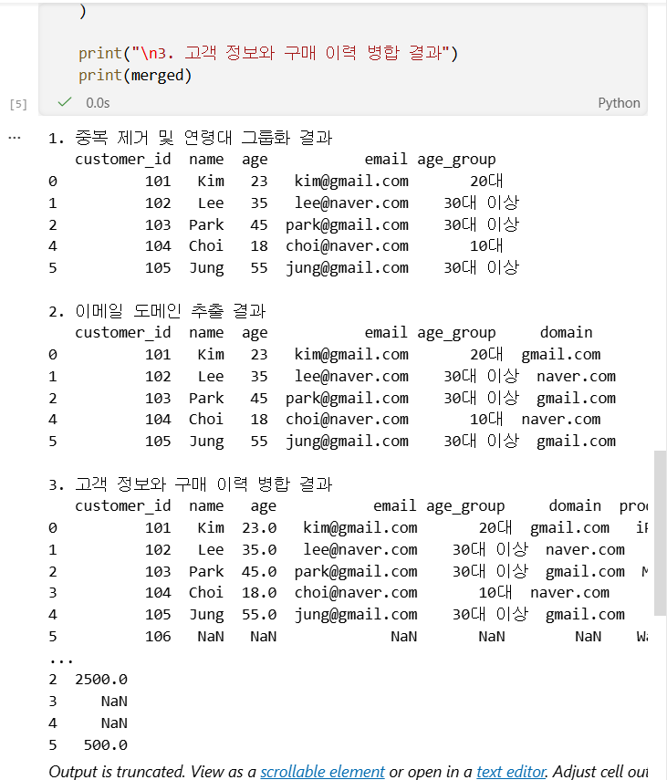

# Python 6주차 정규 과제 

📌Python 정규과제는 매주 정해진 분량의 『*파이썬 라이브러리를 활용한 데이터 분석*』 을 읽고 학습하는 것입니다. 이번주는 아래의 **Python_6th_TIL**에 나열된 분량을 읽고 공부하시면 됩니다.

아래의 문제를 풀어보며 학습 내용을 점검하세요. 문제를 해결하는 과정에서 개념을 스스로 정리하고, 필요한 경우 참고 자료를 통해 보완하는 것이 좋습니다.

**교재 실습 예제 파일은 07_Python_Template 레포지토리의 notebooks 폴더에 업로드되어 있습니다.**

**👀(수행 인증샷은 필수입니다.)** 

## Python_6th_TIL

### 7장 데이터 정제 및 준비 
#### 3. 확장 데이터 유형
#### 4. 문자열 다루기 
#### 5. 범주형 데이터
#### 6. 마치며
### 8장 데이터 준비하기: 조인, 병합, 변형
#### 1. 계층적 색인
#### 2. 데이터 합치기 
#### 3. 재구성과 피벗
#### 4. 마치며 


## Study Schedule

| 주차  | 공부 범위     | 완료 여부 |
| ----- | ------------- | --------- |
| 1주차 | p.25~82    | ✅         |
| 2주차 | p.83~129   | ✅         |
| 3주차 | p.131~179  | ✅         |
| 4주차 | p.181~246 | ✅         |
| 5주차 | p.247~309 | ✅         |
| 6주차 | p.310~379 | ✅         |
| 7주차 | p.381~465 | 🍽️         |


<br>

<!-- 여기까진 그대로 둬 주세요-->

---

# 1️⃣ 학습 내용 정리

## 1. 확장 데이터 유형

### 개념정리

- 확장 데이터 유형은 pandas에서 기본 자료형보다 더 효율적이고 명확하게 데이터를 표현하기 위한 자료형이다.  
대표적으로 문자열 전용 자료형, nullable integer, boolean, categorical 등이 있다.

- 기존에는 결측치가 포함된 정수형 데이터가 자동으로 float으로 바뀌는 문제가 있었다.  
하지만 pandas의 확장 자료형을 사용하면 결측치를 포함하면서도 정수형 의미를 유지할 수 있다.

- 예를 들어 `Int64` 자료형은 일반 `int64`와 다르게 결측치인 `pd.NA`를 함께 저장할 수 있다.
### 실습 인증

<!-- 예제 실습을 진행한 후, 실행 화면을 2-3장 캡쳐하여 제출해주세요. -->




## 2. 문자열 다루기 

### 개념정리


- 이름, 이메일, 주소, 상품명, 로그 데이터 등은 대부분 문자열 형태로 저장된다.

- pandas에서는 문자열 데이터를 처리하기 위해 .str 접근자를 제공한다.
- 이를 사용하면 문자열 분리, 포함 여부 확인, 대소문자 변경, 정규표현식 기반 추출 등을 쉽게 수행할 수 있다.

- 주요 메서드는 다음과 같다.

- str.split() : 문자열을 특정 구분자로 나누기
- str.get() : 나눈 결과에서 특정 위치 값 가져오기
- str.contains() : 특정 문자열 포함 여부 확인
- str.replace() : 문자열 치환
- str.extract() : 정규표현식을 이용한 문자열 추출

### 실습 인증

<!-- 예제 실습을 진행한 후, 실행 화면을 2-3장 캡쳐하여 제출해주세요. -->




## 3. 범주형 데이터

### 개념정리

- 범주형 데이터는 제한된 종류의 값만 가지는 데이터이다.
예를 들어 성별, 혈액형, 지역, 등급, 상품 카테고리 등이 범주형 데이터에 해당한다.

- pandas에서는 category 자료형을 사용해 범주형 데이터를 표현할 수 있다.
범주형 데이터는 문자열을 그대로 저장하는 것보다 메모리를 적게 사용하고, 정렬 순서가 있는 범주를 표현할 수 있다는 장점이 있다.
### 실습 인증

<!-- 예제 실습을 진행한 후, 실행 화면을 2-3장 캡쳐하여 제출해주세요. -->




## 4. 계층적 색인 

### 개념정리

- 계층적 색인은 하나의 축에 여러 단계의 색인을 설정하는 기능이다.
MultiIndex라고도 하며, 고차원 데이터를 2차원 DataFrame 안에서 표현할 수 있게 해준다.
### 실습 인증

<!-- 예제 실습을 진행한 후, 실행 화면을 2-3장 캡쳐하여 제출해주세요. -->




## 5. 데이터 합치기 

### 개념정리

- 데이터 분석에서는 여러 개의 데이터프레임을 하나로 합쳐야 하는 경우가 많다.
pandas에서는 merge(), concat(), join() 등을 사용해 데이터를 합칠 수 있다.

- pd.merge()는 SQL의 JOIN과 비슷하게 공통 열을 기준으로 데이터를 합친다.
### 실습 인증

<!-- 예제 실습을 진행한 후, 실행 화면을 2-3장 캡쳐하여 제출해주세요. -->




## 6. 재구성과 피벗 

### 개념정리

- 재구성과 피벗은 데이터의 형태를 분석 목적에 맞게 바꾸는 작업이다.

- pivot()은 긴 형식의 데이터를 넓은 형식으로 바꿀 때 사용한다.
### 실습 인증

<!-- 예제 실습을 진행한 후, 실행 화면을 2-3장 캡쳐하여 제출해주세요. -->


# 2️⃣ 실습 과제

각 문제에 대한 실행 결과가 확인되도록 코드를 작성하고 실행한 뒤, **모든 문제의 실행 화면을 캡처하여 제출하시기 바랍니다.**

**1. 아래 코드를 실행하여 분석에 필요한 기초 데이터를 생성합니다.**
```python
import pandas as pd
import numpy as np

# 1. 고객 기본 정보
customers = pd.DataFrame({
    "customer_id": [101, 102, 103, 101, 104, 105],
    "name": ["Kim", "Lee", "Park", "Kim", "Choi", "Jung"],
    "age": [23, 35, 45, 23, 18, 55],
    "email": ["kim@gmail.com", "lee@naver.com", "park@gmail.com", "kim@gmail.com", "choi@naver.com", "jung@gmail.com"]
})

# 2. 구매 이력 정보
purchases = pd.DataFrame({
    "customer_id": [101, 102, 103, 106],
    "product": ["iPhone", "iPad", "MacBook", "Watch"],
    "amount": [1500, 800, 2500, 500]
})
```

**2. 문제**
```
1. 중복 고객 제거 및 연령대 그룹화
  - 문제 설명: 고객의 연령대 나누기 
  - drop_duplicates()를 사용하여 customer_id 기준 중복을 제거하세요.
  - pd.cut()을 사용하여 나이(age)를 10대(10-19), 20대(20-29), 30대 이상(30-100)으로 나누고 age_group 열을 만드세요.
  - print()를 이용해 정제된 고객 데이터프레임을 출력하세요.

2. 이메일 도메인 추출
  - 문제 설명: 고객들의 이메일 도메인(gmail, naver 등) 정보만 추출 
  - str.split()과 str.get()을 사용하여 이메일 주소에서 @ 뒷부분의 도메인만 추출하여 domain 열을 만드세요.
  - print()를 이용해 도메인이 추가된 결과를 출력하세요.

3. 고객 정보와 구매 이력 병합
  - 문제 설명: 고객 정보와 구매 이력을 하나로 합치기 
  - pd.merge()를 사용하여 customers와 purchases를 customer_id 기준으로 합치세요.
  - 이때 구매 이력이 없는 고객 정보도 모두 유지되도록 외부 조인(Outer Join) 방식을 사용하세요.
  - print()를 이용해 병합된 최종 데이터프레임을 출력하세요.
```




### 🎉 수고하셨습니다.
